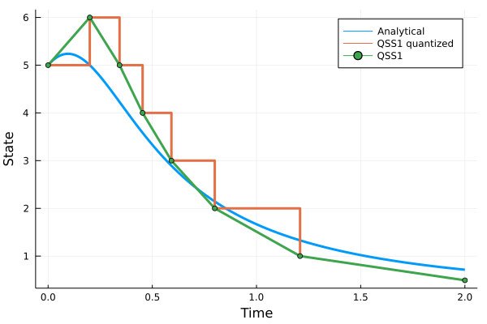

# Examples

## First-order system without an input

Find a solution on the time interval ``[0,2]`` for the first-order system given by the equation

```math
\dot x(t) = \frac{x(t)-2tx^2(t)}{1+t}
```

with the initial condition ``x(0) = 5``.

The model is given by the right-hand side of the state equation and the initial state

```julia
f = (x,u,t) -> (x-2t*x^2)/(1+t)
x₀ = 5.0
```
The time interval

```julia
tspan = (0.0,2.0)
```

The only parameter for the method is the quantum `Δq`

```julia
Δq = 1.0
```

Let's call the solver

```julia
(txarray,xarray,tqarray,qarray) = qss1(g,x₀,tspan,Δq,tuarray,uarray)
```

Before we plot the solution, we take the advantage of availability of a formula for the solution:

```math
x(t) = \frac{t+1}{t^2+1/x(0)}.
```

We plot our (approximating) numerical solution `x` and its quantized counterpart `q`  together with the exact solution.

```julia
using Plots
x(t) = (t+1)/(t^2+1/x₀)
t = range(tspan[1],tspan[2],length=500)
plot(t,x.(t),linewidth=3, xlabel="Time", ylabel="State", label="Analytical", legend=:topright)
plot!(tqarray,qarray, linewidth=3, seriestype = :steppost, label="QSS1 quantized")
plot!(txarray,xarray, linewidth=3, marker=:dot, label="QSS1")
```



## First-order system with an input

Consider a first-order system given by the state equation ``\dot x = -x + u``, where `x` is a state variable and `u` is the provided (control) input, which comes in the form of a delayed (and scaled) [Heaviside step](https://en.wikipedia.org/wiki/Heaviside_step_function) `10u(t-1.76)`. The initial value `x(t₀)=10.0` is given at the initial time `t₀=0`. Evolution of `x(t)` over all times `t` in the interval `[t₀,t₁]`, where `t₁=5` is requested.

The model is given by the right-hand side of the state equation and the initial state
```julia
f = (x,u) -> -1.0*x + u
x₀ = 10.0  
```

The simulation interval is
```julia
tspan = (0.0,5.0)
```

The QSS method assumes thet the (control) input is assumed a piecewise constant function of time, which is perfectly satisfied for the Heaviside step function. In general it is pretty reasonable assumption for systes controlled through computers with [zero order holds](https://en.wikipedia.org/wiki/Zero-order_hold). We enter such inputs as a pair of two vectors – a vector of times when the input changes in a stepwise manner, and a vector of values to which the input changes at the respective times. In particular, the delayd (with the delay of 1.76 s) and scaled (with the factor of 10.0) Heaviside step function is characterized as

```julia
tuarray = [1.76]
uarray = [10.0]
```

The only parameter for the method is the quantum `Δq`. We choose

```julia
Δq = 2.0
```

This is rather rough for practical purposes for the given initial state (of fifth of the initial state) but we will use it to visualize the principle of the method.

Now it is time to call the solver
```julia
(txarray,xarray,tqarray,qarray) = qss1(f,x₀,tspan,Δq,tuarray,uarray)
```
Before we plot the solution, we may appreciate that in the linear case we can get the exact solution using a formula. This will make it possible to see how accurate the QSS1 method is.

```julia
heaviside(t,τ) = t>=τ ? 1.0 : 0.0
x(t) = x₀*exp(-t) + 10.0*(heaviside(t,1.76)*(1.0-exp(-t+1.76)))
t = range(tspan[1],tspan[2],length=500)
```

We can now plot the solution. We will plot not only the state `x` trajectory for the QSS1 method and the "exact" trajectory obtained from the convolution formula, but we will also plot the quantized state `q`. We will also show the (control) input `u`.

```julia
using Plots
p1 = plot(t,x.(t),linewidth=3, label="Analytical solution")
plot!(txarray,xarray, linewidth=3, marker=:dot, label="QSS1 solution")
plot!(tqarray,qarray, linewidth=3, seriestype = :steppost, label="QSS1 quantized solution")
p2 = plot(t,10.0.*heaviside.(t,1.76),linewidth=3,seriestype=:steppost,label="Control")
plot(p1,p2,layout=(2,1))
```


